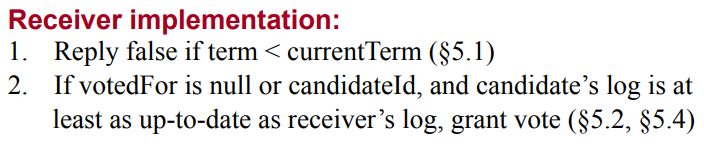

# Distributed System Assignment 2

> 杨茂琛 522023330114

Raft的Go实现

## 设计

每个Raft节点实际上就是数据和状态的集合，根据Raft文章中规定，节点应该具有以下的状态：


这些数据支撑了节点的持续运作与互相交互。在Go的实现中，Raft作为结构体定义如下：

```go
type Raft struct {
	mu        sync.Mutex
	peers     []*labrpc.ClientEnd
	persister *Persister
	me        int // index into peers[]

	// Persistent state on all servers
	CurrentTerm int
	VotedFor    int
	Logs        []LogEntry

	// Volatile state on all servers
	CommitIndex int
	LastApplied int

	// Volatile state on leaders
	NextIndex  []int
	MatchIndex []int

	// state          int 
	leaderId     int
	applyChannel chan ApplyMsg
	unionTimer   *time.Timer
}
```

除了paper中要求的信息，Raft结构额外包含了：

1. 用于线性化的互斥锁
2. 系统中的其他节点
3. 持久化工具（暂时用不到）
4. 自身的id
5. 系统的leader的id
6. 提交log的回调信道
7. 发起选举（非leader）、发送心跳（leader）的计时器

其中，我最开始的实现是使用了一个额外的`state`成员来存储状态。但后续我发现其实通过`leaderId`和`votedFor`即可判断状态：

- `leaderId == me`说明自己是系统的leader
- 若不是leader，`votedFor`非空（非-1）说明有给别人投票、自己是follower，反之则是candidate


本assignment实现的Raft包括以下过程：初始化、选举、新增Entry（心跳）、提交。具体到Go实现，需要实现：

- `Make()`初始化
- `SendRequestVote()`candidate收集投票并唱票
- `RequestVote()`所有状态节点都可能收到的经RPC实现的投票过程
- `sendAppendEntries()`leader发送心跳包或新增entry
- `AppendEntries()`经RPC实现的非leader的心跳或新增entry
- `Start()`所有节点被客户端调用以增加entry的过程

- `apply()`所有节点的提交entry的过程


## 细节

为了缩短篇幅，一些基本的处理、锁操作会被略去。

### `Make()`

这个方法由管理系统的其他程序调用，会创建一个新的节点，对其初始化，使其开始工作，最后返回该节点：

```go
func Make(peers []*labrpc.ClientEnd, me int,
	persister *Persister, applyCh chan ApplyMsg) *Raft {
	// ...

	rf.CurrentTerm = 0
	rf.VotedFor = -1
	rf.Logs = []LogEntry{{Term: -1, Command: nil}}

	rf.CommitIndex = 0
	rf.LastApplied = 0

	// ...

	rf.leaderId = -1
	rf.applyChannel = applyCh
	rf.unionTimer = time.NewTimer(time.Second)
	rf.resetElectionTimer(false)

	go func() {
		for {
			if rf.leaderId == rf.me {
				select {
				case <-rf.unionTimer.C: // send heartbeat
					go rf.sendAppendEntries(-1) // just heartbeat
				case <-time.After(10 * time.Millisecond):
					// do nothing
				}
			} else {
				select {
				case <-rf.unionTimer.C: // send request vote
					electionResult := rf.sendRequestVote()
					if electionResult && rf.leaderId == -1 {
						rf.mu.Lock()
						rf.leaderId = rf.me
						for i := range rf.peers {
							rf.NextIndex[i] = len(rf.Logs)
							rf.MatchIndex[i] = 0
						}
						rf.mu.Unlock()
					}
				case <-time.After(10 * time.Millisecond):
					// do nothing
				}
			}
		}
	}()

	return rf
}
```

代码中省略了一些较少争议的部分。

因为Raft的设定中log的编号从1开始，所以在Logs中预先放置一个无意义的log。该log的term为-1，因为节点的term从0开始初始化，最早的任期也至少从1开始，-1表示无效性。

`rf.resetElectionTimer()`是我为了抽象的一个小方法，用于重置计时器。参数为`true`表示是计时器将被用于发送心跳包的倒计时（更短），为`false`表示被用于发起选举的倒计时（更长）：

```go
func (rf *Raft) resetElectionTimer(isHeartbeat bool) {
	nextTimeout := time.Duration(MIN_ELECTION_TIMEOUT+rand.Intn(MAX_ELECTION_TIMEOUT-MIN_ELECTION_TIMEOUT)) * time.Millisecond
	if isHeartbeat {
		nextTimeout = 50 * time.Millisecond
	}
	rf.unionTimer.Reset(nextTimeout)
}
```

`rf.sendAppendEntries()`的参数`-1`的含义见后文

### `sendRequestVote()`

该方法在选举倒计时后被调用，用来发起选举。

对candidate而言，选举的过程主要有以下部分：

0. 调整状态为candidate

1. 准备RequestVote并发送给其他所有节点（对于自身，可以发送也可以省事直接记1票同意）
2. 在一定时限内收集投票结果并唱票，返回投票是否过半


作为leader时永远不会调用这个方法，所以当前只可能是非leader，无论具体是什么状态，直接将自身的状态变为candidate：

```go
	rf.leaderId = -1 // 必须丢弃旧leader，不再是follower
	rf.CurrentTerm += 1
	rf.VotedFor = rf.me
	rf.resetElectionTimer(false)
```


为了唱票，需要维护一个数据结构记录得票数。用简单的变量累加票数的话，可能会出现两个协程同时增加1票但由于竞争的关系最终只增加1票的情况；所以使用信道的方式收集得票，为了不阻塞唱票环节使用带缓冲的信道。

```go
	voteResult := make(chan bool, len(rf.peers))
	voteResult <- true // self
```


对于发送RequestVote环节，该方法会对每一个节点开一个协程用来处理流程：

```go
go func(dst int) {
    reply := RequestVoteReply{
        Term:        rf.CurrentTerm,
        VoteGranted: false,
    }
    if rf.leaderId != -1 || rf.CurrentTerm > args.Term { // 已经是leader或者是旧的选举
        voteResult <- false
        return
    }
    if rf.peers[dst].Call("Raft.RequestVote", args, &reply) {
        if reply.Term > rf.CurrentTerm {
            // 选举失败变回follower
            rf.CurrentTerm = reply.Term
            rf.VotedFor = -1
            // 不修改leaderId 可能正在给人投票
        }
    }
    voteResult <- reply.VoteGranted
}(i)
```

因为发送RequestVote前，可能系统已经选出了新leader（不管是不是自己），所以需要额外判断一次还要不要继续参加选举。不参加则往唱票信道送入一个false就退出。

收到投票结果后，需要再次确认自己是否还有参选资格，所以需要比对返回的term是否更大。如果确实有新leader了就回退到follower


唱票时，使用Go的select-case来方便地处理RPC超时/错误等情况：

```go
	voteCount := 0
	for range rf.peers {
		select {
		case granted := <-voteResult:
			if granted {
				voteCount++
			}
			if rf.leaderId != -1 || voteCount > len(rf.peers)/2 {
				return voteCount > len(rf.peers)/2
			}
		case <-time.After(100 * time.Millisecond):
			return voteCount > len(rf.peers)/2
		}
	}
	return voteCount > len(rf.peers)/2
```

唱票途中如果票数已经足够，或者出现100毫秒后仍没有新的投票结果送到则提前结束唱票。


### `RequestVote()`

对于收到要求投票的节点，要进行的工作就是根据条件判断是否支持该candidate即可：

```go
func (rf *Raft) RequestVote(args RequestVoteArgs, reply *RequestVoteReply) {
	rf.mu.Lock()
	defer rf.mu.Unlock()

	reply.Term = rf.CurrentTerm
	reply.VoteGranted = false

	if args.Term > rf.CurrentTerm { // 无条件更新term
		rf.CurrentTerm = args.Term
		rf.VotedFor = -1
		if rf.leaderId == rf.me {
			rf.leaderId = -1
		}
	}

	if rf.VotedFor == args.CandidateId || (rf.VotedFor == -1 && isCandidateLogUpToDate(args, rf.Logs)) {
		reply.VoteGranted = true
		rf.VotedFor = args.CandidateId
		rf.resetElectionTimer(false)
	}
}

func isCandidateLogUpToDate(args RequestVoteArgs, logs []LogEntry) bool {
	lastIndex := len(logs) - 1
	return args.LastLogTerm > logs[lastIndex].Term ||
		(args.LastLogTerm == logs[lastIndex].Term && args.LastLogIndex >= lastIndex)
}
```

根据Raft的设定，只有candidate手上的log信息至少是up to date自己的log信息才支持，并且一个term中只投1票绝不多投超过1个candidate：




### `sendAppendEntries()`

该方法和`sendRequestVote()`其实很像，都是只有1个节点进行对多个节点的调用，并收集调用结果做进一步处理

方法有一个参数`sendAppendEntries(updateEnd int)`用于标识本次append entries的性质和终点。如果`updateEnd == -1`表示这次只是一次心跳；如果不为`-1`则这次append entries需要将log index小于updateEnd的log都复制好。

leader对各个节点的处理协程如下：

```go
		go func(dst int, appendEnd int) {
			reply := AppendEntriesReply{
				Term:    -1,
				Success: false,
			}
			for {
				var entries []LogEntry = nil // 必须显式指定为nil
				if appendEnd != -1 {
					if rf.leaderId != rf.me || rf.NextIndex[dst] >= appendEnd {
						// 丧权或已成为过时消息
						break
					}
					entries = rf.Logs[rf.NextIndex[dst]:appendEnd]
				}
				prevLogIndex := rf.NextIndex[dst] - 1
				args := // ...
				if !rf.peers[dst].Call("Raft.AppendEntries", args, &reply) { // RPC failed, nothing to do
					break
				}
				if reply.Term > rf.CurrentTerm || rf.leaderId != rf.me {
					// 丧权或已成为过时消息
					break
				}
				if reply.Success {
					if appendEnd != -1 {
						if rf.NextIndex[dst] < appendEnd-1 {
							rf.NextIndex[dst] = appendEnd - 1
							rf.MatchIndex[dst] = appendEnd - 1
						}
					}
					break
				} else {
					appendEnd = len(rf.Logs)
					if rf.NextIndex[dst] > 1 {
						rf.NextIndex[dst] -= 1
					}
				}
			}
			appendResult <- reply.Success
		}(i, updateEnd)
```

略去了一些锁操作和细节代码。

对于每个节点，它的log可能落后了若干项，对于不确定具体数目的append，这里用一个for死循环实现反复append。

因为这个append过程可能持续挺久的，其中可能系统状态也会发生变化，需要时不时确认自身是否还是leader、append是否还有必要。

当RPC失败时，根据Raft的设定，不做额外的工作而是反复地重试。基于RPC是幂等的这一条件，反复请求不会导致一致性错误。

当节点成功append时，leader维护自己记录的所有节点的log同步情况；当节点失败append时，说明发去的条件与节点不匹配，需要后退NextIndex并在下一次for循环时多发一个更早的log。反复后退后一定会达成一致性。


在发append的同时，leader会试图从结果信道里获取消息。时机成熟时将新的log进行apply：

```go
	successCount := 0
	for range rf.peers {
		select {
		case success := <-appendResult:
			if updateEnd == -1 {
				return
			}
			if success {
				successCount++
				if successCount > len(rf.peers)/2 {
					rf.mu.Lock()
					if updateEnd-1 > rf.CommitIndex {
						rf.CommitIndex = updateEnd - 1
						go rf.apply(rf.CommitIndex)
					}
					rf.mu.Unlock()
					return
				}
			}
		case <-time.After(100 * time.Millisecond):
			return
		}
	}
```

当`updateEnd == -1`即心跳包时，leader会直接结束统计。因为心跳包只要发过就行了。根据Raft设定，leader不需要太关注其他节点的运行情况，它只尽自己有限的责任。

如果这次`sendAppendEntries`是因新entry而被调用的话，leader会统计成功同步的节点数（含自己）。只要数量过半，根据Raft的设定，leader认为已对这个entry达成了共识，那么就自行提交并更新`CommitIndex`。更新`CommitIndex`的影响会在下一次心跳包或append时体现，follower在那时才会进行自己的apply。


### `AppendEntries()`

该过程是非leader收到的心跳或append。

```go
func (rf *Raft) AppendEntries(args ApplyEntriesArgs, reply *AppendEntriesReply) {
	// 对自身进行维护
    // ...
    
    if args.Term < rf.CurrentTerm || len(rf.Logs) <= args.PrevLogIndex || rf.Logs[args.PrevLogIndex].Term != args.PrevLogTerm {
        reply.Success = false
        return
    }
    
    reply.Success = true
	if args.Entries != nil {
		entryIndex := 0
		for i := args.PrevLogIndex + 1; i < len(rf.Logs) && entryIndex < len(args.Entries); i++ {
            // 覆盖不一致的
			rf.Logs[i] = args.Entries[entryIndex]
			entryIndex++
		}
		for entryIndex < len(args.Entries) {
            // 补充没有的
			rf.Logs = append(rf.Logs, args.Entries[entryIndex])
			entryIndex++
		}
	}
	if args.LeaderCommit > rf.CommitIndex {
        // 根据leader传来的系统的一致性情况决定是否提交
		rf.CommitIndex = min(args.LeaderCommit, len(rf.Logs)-1)
		go rf.apply(rf.CommitIndex)
	}
}
```

非leader节点返回success与否，取决于自己和leader是否在PrevLogIndex及之前达成了共识：


根据Raft的设定，只要在某一个log达成一致性，该log之前的log也必定达成了一致性。


### `Start()`

该方法是暴露给客户端进行调研的RPC方法。

```go
func (rf *Raft) Start(command interface{}) (int, int, bool) {
	index := -1
	term := rf.CurrentTerm
	isLeader := rf.leaderId == rf.me

	if isLeader {
		index = len(rf.Logs)
		rf.Logs = append(rf.Logs, LogEntry{
			Term:    term,
			Command: command,
		})
		go rf.sendAppendEntries(len(rf.Logs))
	}
    
	return index, term, isLeader
}
```

所有的节点都可能被调用，因为客户端不太关心系统现在到底谁是leader。

如果非leader收到了，它不会接受而是将leader信息告知客户端。客户端获得leader信息后自行向leader重发请求。

leader收到后几乎立刻返回成功，为的就是不对客户端、自身造成阻塞。

leader收下客户端的command，构造新的log并记录，然后立即进行一次append entries。参数`updateEnd`为`len(rf.Logs)`含义即是要求同步包括最新这条log的所有log。


### `apply()`

在leader发现某个log已经复制到系统内超过半数的节点上时，它认为这个log已经成为了共识、可以apply。

节点无论什么身份，都需要自己调用`apply()`来应用log。

```go
func (rf *Raft) apply(commitIndex int) {
	for rf.LastApplied < commitIndex {
		rf.LastApplied += 1
		rf.applyChannel <- ApplyMsg{
			Index:   rf.LastApplied,
			Command: rf.Logs[rf.LastApplied].Command,
		}
	}
}
```

`LastApplied`是每个节点都在维护的信息，意指最后一个应用的log。

只要`LastApplied`还有增长的空间，节点就会一直apply并递增`lastApplied`。在应用这个log后，将这次应用的信息送入自己的`applyChannel`信道实现反馈机制。


## 结果


测试结果如图。


Persist之前的测试都可以正常通过。

将代码中的输出debug的信息注释后运行一次TestReElection观察输出：


中途因为被disconnect了，选举一直无法成功。在重新connect后系统第一执行恢复了正常运转。

运行一次TestFailAgree观察输出：


## 总结

Raft通过任期实现了log的逻辑时钟，进而实现了对leader的新旧的评估，使得系统在出现问题后能够准确地恢复到正常运行状态。

Raft的3种身份的流转的设定使得既不需要一个中心化节点又能实现快速的节点们的自治，兼具效率和鲁棒性。

Raft中多处提到了“超过半数”。这和读写团体一致性的思路是相似的，写团体的人数过半保证了一致性。
